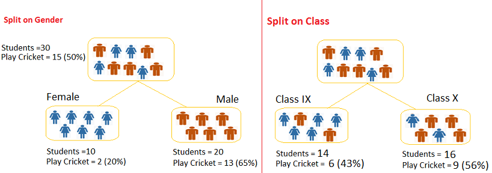

*Dựa vào đặc điểm của biến mục tiêu, có thể chia Decision Tree thành hai dạng : Regression Tree và Classification Tree. Nếu biến mục tiêu thuộc dạng continous variable, Decision Tree được gọi là Regression Tree (hay còn gọi là Continous Variable Decision Tree). Ngược lại nếu biến mục tiêu thuộc dạng categorical variable, Decision Tree được gọi là Classification Tree (hay còn gọi là Categorical Variable Decision Tree).*

## Regression Tree và Classification Tree

Cả 2 loại tree đều có cách thức hoạt động giống nhau, dưới đây là so sánh giữa Regression Tree và Classification Tree

1. Regression Tree có biến mục tiêu là biến liên tục, trong khi Classification Tree có biến mục tiêu la biến phân loại.
2. Trong Regression Tree, khi huấn luyện, giá trị tại nút lá bằng trung bình các giá trị biến mục tiêu của các điểm dữ liệu có trong nút đó. Nên khi đưa tập test vào, nếu các điểm dữ liệu rơi vào nút lá nào, kết quả trả ra sẽ là giá trị trung bình.
3. Với Classification Tree, khi huấn luyện, giá trị tại nút lá(phân lớp) bằng giá trị có tần suất cao nhất(Mode) của các dữ liệu trong nút đó. Nên khi đưa tập test vào, nếu các điểm dữ liệu rơi vào nút lá nào, kết quả trả ra sẽ là Mode.

## Làm sao Decision Tree quyết định khi nào sẽ phân nhánh

Các quyết định phân nhánh sẽ ảnh hưởng đến độ chính xác của Cây quyết đinh. Cây hồi quy và cây phân lớp có các thuật toán phân nhánh khác nhau. Có nhiều thuật toán phân nhánh, tùy vào kiểu của biến mục tiêu mà sử dụng thuật toán như thế nào. Có 4 thuật toán chính :

### Gini Index

Gini phát biểu rằng, nếu lấy hai quan sát từ 1 tập dữ liệu đồng nhất thì xác suất hai quan sát đó cùng lớp là bằng 1.

1. Nó áp dụng cho biến mục tiêu là biến phân loại có dạng “Success” và “Failure”
2. Nó chỉ được dùng cho phân nhánh nhị phân.
3. Giá trị của Gini càng cao thì tính đồng nhất càng cao
4. CART(Classification and Regression Tree) sử dụng Gini cho phân lớp nhị phân

**Các bước để tính chỉ số Gini**

1. Tính Gini cho sub-node bằng cách tính tổng bình phương xác suất của “succsess” và “failure” $(p^2+q^2)$
2. Tính trọng số Gini cho việc phân nhánh

**Ví  dụ**  

**Phân nhánh theo thuộc tính Gender**

1. Tính Gini cho node Female :
$0.2^2 +0.8^2 =0.68$
2. Gini cho node Male :
$0.65^2 + 0.35^2 = 0.55$
3. Tính trọng số Gini cho việc phân nhánh theo Gender :
$0.68 * \frac{10}{30} + 0.55 * \frac{20}{30} = 0.59$

**Phân nhánh theo thuộc tính Class**

1. Tính Gini cho node Class IX :
$0.43^2 + 0.57^2 = 0.51$
2. Tính Gini cho node Class X :
$0.56^2 + 0.44^2 = 0.51$
3. Tính trọng số Gini cho việc phân nhánh theo Class :
$0.51 * \frac{14}{30} + 0.51 * \frac{16}{30} = 0.51$

Ta nhận thấy Gini Score cho **Gender** cao hơn **Class** , do đó việc phân nhánh sẽ dựa trên thuộc tính **Gender**

### Chi-Square

Thuật toán tìm ý nghĩa thống kê giữa sự khác nhau của node con và node cha. Chi-square được tính bằng cách tính tổng bình phương độ lệch chuẩn giữa các quan sát và kì vọng tần suất của biến phụ thuộc

1. Nó áp dụng cho biến mục tiêu là biến phân loại có dạng “Success” và “Failure”.
2. Nó có thể làm việc trên phân nhánh nhị phân và đa phân nhánh.
3. Giá trị của Chi-square càng cao thì ý nghĩa thống kê về sự khác nhau giữa node con và node cha càng cao.
4. Công thức tính Chi-square trên mỗi node
Chi-square =  ((Thực tế – Kì vọng)^2 / Kì vọng)^1/2
5. Tree sử dụng thuật toán Chi-square được gọi là CHAID(Chi-square Automatic Interaction Detectior)

**Các bước để tính chỉ số Chi-Square cho phân nhánh**

1. Tính Chi-square cho từng node bằng cách tính độ lệch của Success và Failure
2. Tính Chi-square của phân nhánh bằng cách tính tổng Chi-square của Success và Failure

**Ví dụ**

**Phân nhánh theo thuộc tính Gender**

1. Với node Female, Play = 2 và Not Play = 10 – 2 = 8
2. Tính toán giá trị kì vọng cho Play và Not Play. Ở node cha, xác suất Play = Not Play = 0.5. Do đó kì vọng Play ở node con = 0.5 * 10 = 5 và kì vọng Not Play ở node con = 0.5 * 10 = 5
3. Tính toán độ lệch giữa thực tế và kì vọng. Độ lệch cho Play = 2 – 5 = -3 và độ lệch cho Not Play = 8 – 5 =3
4. Tính toán Chi-square trên từng node cho Play theo công thức  Chi-square =  ((Thực tế – Kì vọng)^2 / Kì vọng)^1/2 . Kết quả được biểu diễn bên dưới
5. Thực hiện các bước tương tự với node Male.
6. Tính tổng các giá trị Chi-square

**Phân nhánh theo thuộc tính Class** 

Ta nhận thấy Chi-Square Score cho **Gender** cao hơn **Class** , do đó việc phân nhánh sẽ dựa trên thuộc tính **Gender**

### Information Gain

Entropy là chỉ số để đo độ hỗn loạn của dữ liệu.Entropy càng thấp thì độ hỗn loạn càng thấp, nghĩa là việc phân nhánh càng cho kết quả tốt. Nếu mẫu hoàn toàn tính khiết thì Entropy bằng 0 và nếu mẫu được chia đều 50% – 50% thì Entropy bằng 1.

Công thức tính Entropy được biểu diễn như sau

$Entropy = -p log_2 p - q log_2 q$

**Các bước tính Entropy cho phân nhánh**

1. Tính Entropy cho node cha
2. Tính Entropy cho từng node con sau khi phân nhánh và tính trọng số trung bình của toàn bộ nút con.

**Ví dụ:**

**Phân nhánh theo thuộc tính Gender**

1. Entropy của node cha :
$-\frac{15}{30}log_2(\frac{15}{30})-\frac{15}{30}log_2(\frac{15}{30})=\mathbf{1}$
2. Entropy cho node Female:
$-\frac{2}{10}log_2(\frac{2}{10})-\frac{8}{10}log_2(\frac{8}{10})=0.72$
3. Entropy cho node Male:
$-\frac{13}{20}log_2(\frac{13}{20})-\frac{7}{20}log_2(\frac{7}{20})=0.93$
4. Entropy cho thuộc tính Gender:
$\frac{10}{30} * 0.72 + \frac{20}{30} * 0.93 =\mathbf{0.86}$

**Phân nhánh theo thuộc tính Class**

1. Entropy cho node Class IX:
$-\frac{6}{14}log_2(\frac{6}{14})-\frac{8}{14}log_2(\frac{8}{14})=0.99$
2. Entropy cho node Class X :
$-\frac{9}{16}log_2(\frac{9}{16})-\frac{7}{16}log_2(\frac{7}{16})=0.99$
3. Entropy cho thuộc tính Class
$\frac{14}{30} * 0.99 + \frac{16}{30}*0.99=\mathbf{0.99}$

Ta nhận thấy Entropy Score cho **Gender** thấp hơn **Class** , do đó việc phân nhánh sẽ dựa trên thuộc tính **Gender.**  Hoặc có thể tính Information Gain = 1  – Entropy, Phân nhánh nào có Information Gain cao hơn sẽ được chọn.

### Reduction in Variance

Cả ba thuật toán trên đều áp dụng cho Categorical Decision Tree. Reduction in Varicance là thuật toán sử dụng cho Regression Decision Tree. Thuật toán sử dụng phương sai để chọn việc phân nhánh. Phân nhánh nào có phương sai nhỏ hơn thì sẽ được chọn. Công thức tính như sau

$Variance = \frac{\Sigma(X-\bar{X})^2}{n}$

Trong đó $\bar{X}$ là giá trị trung bình, $X$ là giá trị thực tế và $n$ là số phần tử

**Các bước tính Variance :**

1. Tính variance trên mỗi node
2. Variance cho mỗi phân nhánh bằng trung bình variance của các node con

**Ví dụ** : Để đơn giản cho bài toán Regression ,  chúng ta tiến hành chuẩn hóa biến mục tiêu như sau : giá trị 1 đại diện cho Play và giá trị 0 đại diện cho Not play

**Phân nhánh theo thuộc tính Gender**
1. Tính Variance của node cha:
$Mean = \frac{15*1 + 15*0}{30} = 0.5$
$Variance = \frac{(1-0.5)^2 + ... +(1-0.5)^2 +(0-0.5)^2 +....+(0-0.5)^2}{30} =\mathbf{0.25}$
2. Tính Variance cho node Female:
$Mean  =\frac{2*1 + 8*0}{10}=0.2$   
$Variance = \frac{(1-0.2)^2 + (1-0.2)^2 + (0-0.2)^2 +......+(0-0.2)^2}{10} = 0.16$
3. Tính Variance cho node Male:
$Mean = \frac{13*1 + 7*0}{20} = 0.65$  
$Variance = \frac{(1-0.65)^2+....+(1-0.65)^2+(0-0.65)^2+.....+(0-065)^2}{20}=0.23$
4. Tính Variance cho việc phân nhánh theo Gender
$\frac{10}{30}*0.16 + \frac{20}{30}*0.23=\mathbf{0.21}$

**Phân nhánh theo thuộc tính Class**
1. Tính Variance cho node IX: 
$Mean =\frac{6*1 + 8*0}{14}=0.43$
$Variance=\frac{(1-0.43)^2+...+(1-0.43)^2+...+(0-0.43)^2+....+(0-043)^2}{14}=0.24$
2. Tính Variance cho node X:
$Mean =\frac{9*1 + 7*0}{16}=0.56$
$lVariance=\frac{(1-0.56)^2+...+(1-0.56)^2+(0-0.56)^2+...+(0-0.56)^2}{16} = 0.25$
3. Tính Variance cho việc phân nhánh theo Class:
$\frac{14}{30}*0.24 +\frac{16}{30}*0.25 = \mathbf{0.25}$

Ta nhận thấy Variance của **Gender**  thấp hơn so với **Class** , do đó việc phân nhánh sẽ dựa trên thuộc tính **Gender**

[Link bài viết](https://www.lehuynhduc.com/tree-based-modeling-phan-2/)
